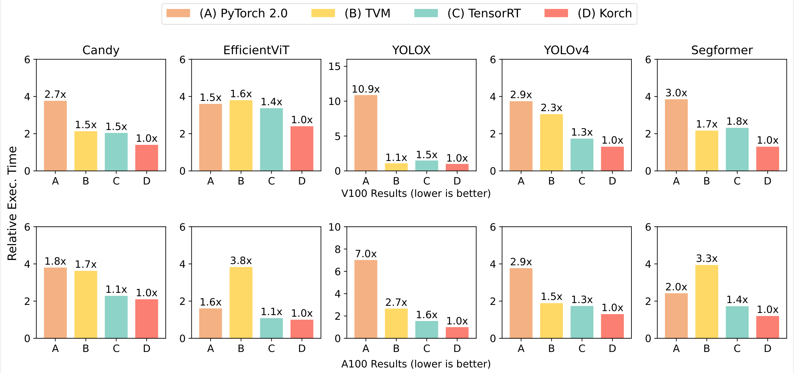

# Optimal Kernel Orchestration for Tensor Programs with Korch ([paper](https://dl.acm.org/doi/abs/10.1145/3620666.3651383))

Kernel orchestration is the task of mapping DNN operator computation to hardware accelerator kernels. Korch is a tensor program optimizer that discovers optimal kernel orchestration strategies for tensor programs, by first applying operator fission to decompose tensor operators into a small set of basic tensor algebra primitives, then formalizing kernel orchestration as an ILP (Integer Linear Programming) problem. Korch outperforms existing tensor compilers by up to 1.7x.



## Environment Preparation

### Set up Python Environment

```bash
pip install tornado psutil 'xgboost<1.6.0' cloudpickle onnx onnx-graphsurgeon==0.3.27 transformers netron sortedcontainers pulp==2.7.0
```

### Install TVM

Install CUDA, CUDNN and LLVM first. Then install TVM with the following commands:

```bash
git clone --recursive https://github.com/balamurugan15/tvm-kernel-mapper.git tvm
export TVM_HOME=`realpath tvm`
export PYTHONPATH=$TVM_HOME/python:${PYTHONPATH}
cd tvm
mkdir build && cd build
cp ../cmake/config.cmake .
cmake ..
make -j4
python -c "import tvm; print(tvm.__version__)"
```

Showing `0.13.dev0` means that TVM has been installed correctly.

### Clone and Compile Korch

```bash
git clone https://github.com/humuyan/Korch.git korch
cd korch/operators
./build.sh
mv *.so ../framework
```

## Run Korch

Korch takes an ONNX graph as input. See `cases/onnx-export/export.py` for ONNX export of benchmark models in the paper. 

### Operator Fission

```bash
cd ../framework
python operator_fission.py [input_onnx_path] [output_onnx_path]
```

### Kernel Orchestration

Run `calc.py` to calculate the optimial kernel orchestration strategy. For example, to run candy case on A100:

```bash
python calc.py candy.onnx a100 --database_dir candy_db
```

The selected kernel ids in the optimal strategy will be printed. The corresponding ONNX subgraphs can be found in `candidate_kernel_graphs` folder under `database_dir`.

To reduce search overhead, complicated graphs need a config file to manually specifiy the cut points for graph split. Check the toml files under `cases` directory for config files of Segformer, YOLOv4 and YOLOX.

See `python calc.py -h` for more details. WARNING: the codegen option `--code_output_dir` is experimental and only works for candy case.

### Support More Devices and Backends

Currently Korch has implemented cuBLAS/cuDNN library profiler, TVM profiler and TensorRT profiler for Nvidia V100, A100 and RTX A5000. To support more devices, please modify `configure_target` function in `utils.py`. To add a new profiler, you can inherit a new Python class from `KernelProfiler` in `profiler.py` and add this class to the profiling logic (L402 in `calc.py`).

## Acknowledgement

Korch is maintained in a private repository, so code contribution in this repository is not accurate. We thank Ashwin Venkatram, Balamurugan Marimuthu and Shreyashri Biswas for their contribution to this project. Special thanks to Jiachen Yuan for open source of this repository.

## Contact

Muyan Hu: <muyanhu2@illinois.edu>

## Citation

If Korch is useful or relevant to your research, please kindly recognize our contributions by citing our paper:

```
@inproceedings{hu2024optimal,
  title={Optimal Kernel Orchestration for Tensor Programs with Korch},
  author={Hu, Muyan and Venkatram, Ashwin and Biswas, Shreyashri and Marimuthu, Balamurugan and Hou, Bohan and Oliaro, Gabriele and Wang, Haojie and Zheng, Liyan and Miao, Xupeng and Zhai, Jidong and others},
  booktitle={Proceedings of the 29th ACM International Conference on Architectural Support for Programming Languages and Operating Systems, Volume 3},
  pages={755--769},
  year={2024}
}
```